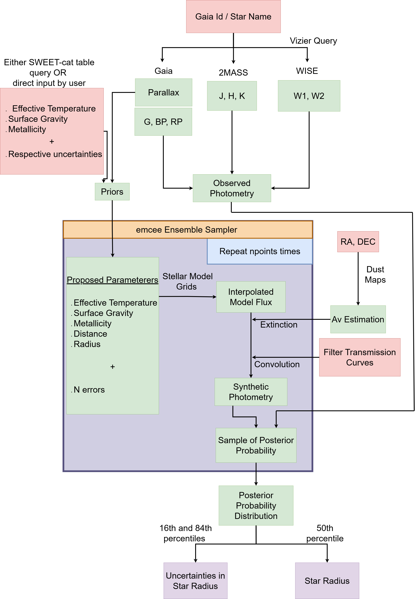
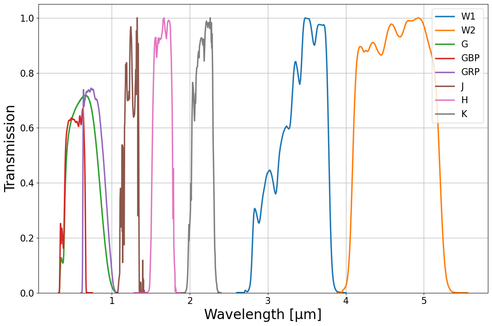
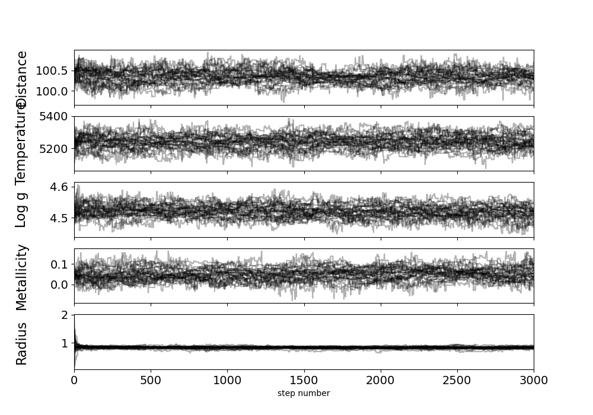
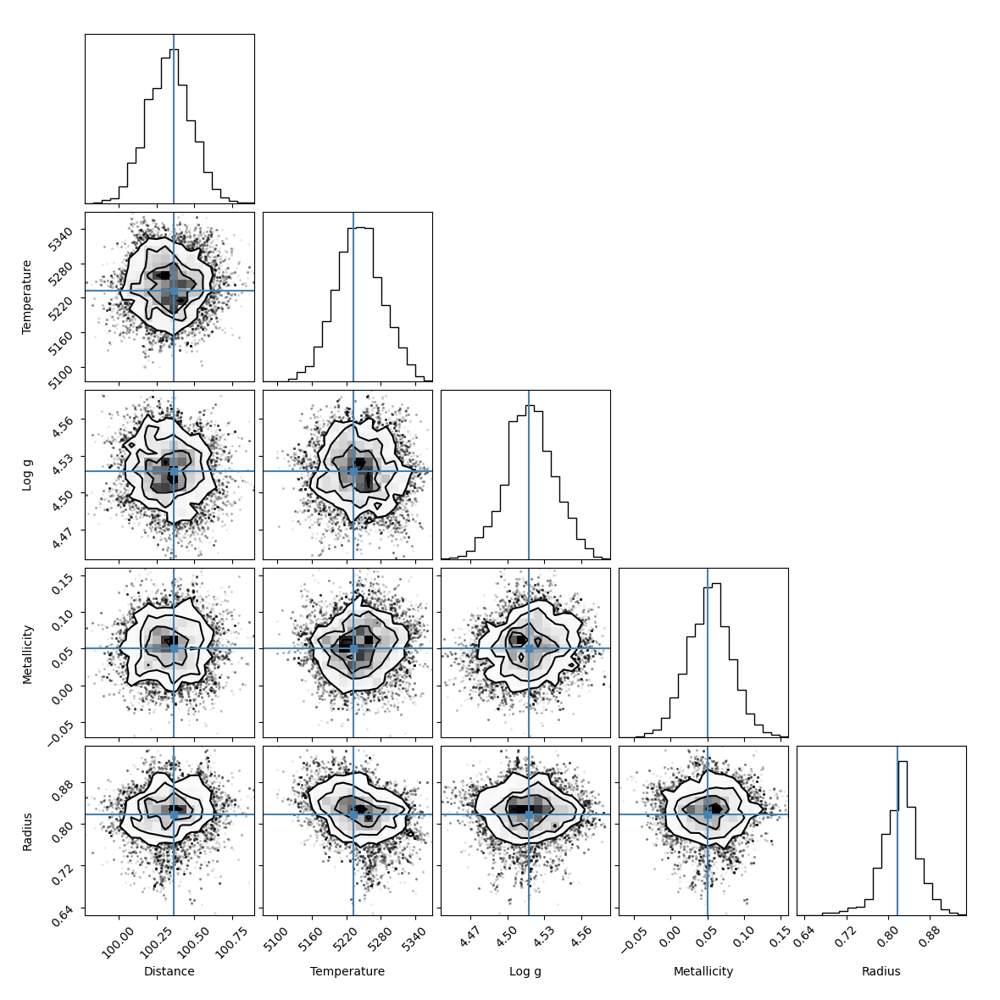

# Stellar Radius Inference

A Python-based data pipeline and Bayesian statistical modelling project for estimating stellar radii from heterogeneous astronomical observations for planet hosting stars.

The project was originally developed as part of my MSc dissertation in Astronomy and Astrophysics at the University of Porto. It has since been reorganized and revised into a standalone portfolio project, with particular emphasis on data retrieval, data cleaning, Bayesian statistical inference and uncertainty propagation.

## Project Overview

Estimating the physical properties of stars requires combining observations from multiple astronomical surveys in different conditions and wavelengths. These datasets differ in format, identifiers, available measurements, units, and uncertainties. This project brings those observations together and uses them to infer stellar properties through Bayesian modelling.

The pipeline developed follows the steps: 

1. Retrieves stellar parameters from astronomical databases using SQL/ADQL
2. Retrieves photometric measurements from GAIA, 2MASS and WISE surveys 
3. Cross-matches observations belonging to the same star
4. Validates and combines measurements from different surveys
5. Converts photometric measurements into comparable physical fluxes in chosen units
6. Models the stellar spectral energy distribution - SED graphs
7. Uses Bayesian inference and Markov Chain Monte Carlo (MCMC) to estimate stellar radius
8. Quantifies uncertainty in the resulting estimates
9. Compares inferred radii against reference measurements for validation

The main goal of the project is therefore not only the astrophysical result, but the construction of an end-to-end pipeline for working with heterogeneous scientific data.

## Data Pipeline

A major component of the project is the integration of heterogeneous observational data.

<div align="center">



<p><em>Diagram representation of the end-to-end pipeline for this project. </em></p>

</div>

### <u>Data retrieval and sources</u> 

#### SWEET-cat 

SWEET-Cat provides the stellar parameters used as external constraints in the inference, including:

* Effective temperature
* Surface gravity
* Metallicity
* Reference stellar radius
* Gaia identifier
* Parallax and distance information

The project queries the catalogue programmatically through the VizieR TAP service using ADQL. The different catalogues use different identifiers and data formats, so the pipeline performs catalogue cross-matching to associate observations with the correct stellar source.

#### Photometric surveys 

| Survey | Band | Approx. wavelength |
|---|---|---:|
| Gaia | GBP | 0.532 μm |
| Gaia | G | 0.673 μm |
| Gaia | GRP | 0.797 μm |
| 2MASS | J | 1.25 μm |
| 2MASS | H | 1.65 μm |
| 2MASS | Ks | 2.15 μm |
| WISE | W1 | 3.4 μm |
| WISE | W2 | 4.6 μm |

<div>



<p><em>Transmission functions for the bands considered. </em></p>

</div>


### <u>Data processing</u> 

Retrieved measurements are processed before being used by the statistical model. This includes:

* Identifying and validating catalogue matches
* Handling missing photometric bands
* Selecting the available observations for each star
* Converting magnitudes into physical fluxes
* Propagating observational uncertainties
* Converting measurements between compatible units
* Combining measurements from different surveys into a single dataset

The pipeline was also tested against larger stellar samples, where common failure cases included missing catalogue matches, incomplete photometry, and inconsistent source identifiers.


### <u>SED Modelling</u> 

The observed photometric data is compared against synthetic stellar spectral energy distributions generated from a 3 dimensional grid of stellar atmosphere models, using Kurucz and Castelli stellar atmosphere atlas. The model is interpolated across effective temperature, metallicity and surface gravity, and gives a spectrum wide curve for energy distribution.

The resulting model is then processed: 
1. Attenuated for interstellar extinction, according to published extinction laws and dust maps
2. Integrated through the relevant photometric filter transmission functions, found in the *filters* folder of the repository
3. Scaled according to distance and stellar radius
4. Compared to the observed data 

This model therefore connects the observed multi-band photometry to the physical stellar radius.


### <u>Bayesian inference</u> 

The main inference model uses Markov Chain Monte Carlo (MCMC) to estimate the stellar radius and associated parameters.

The model has 5 + N parameters, where N is the number of photometric values found for a given star:

* Distance
* Effective temperature
* Surface gravity
* Metallicity
* Stellar radius
* N photometric noise parameters

Informative priors are used for parameters with external observational constraints, while the photometric noise is modelled explicitly.

The posterior distribution therefore incorporates both:

Uncertainty in the input stellar parameters
Measurement uncertainty in the observed photometry

The radius is estimated from the posterior distributions' 50th percentile, while the 16th and 84th percentiles are used to characterize the uncertainty.

## Example: WASP-84 

The repository includes a working example as a quick validation and demonstration of the workflow of the pipeline. 

The input parameters and their respective uncertainties are obtained from querying SWEET-cat directly. The extinction value used was 0.020, obtained from literature. 

For the MCMC set-up, the example uses **32 walkers** and **1000** steps. These conditions can be easily changed for better performance/speed ratio, taking into account the walkers must always be above a certain number (2 times the number of parameters). 

To run, from the repository root:

> python -m tests.wasp84 

The script performs the complete analysis and prints the inferred radius, uncertainty and difference from the reference value. A representative test was run for this document, producing the following results: 

| Result | Value |
|---|---:|
| Inferred radius | 0.837 R☉ |
| Uncertainty | ±0.024 R☉ |
| Reference radius | 0.828 R☉ |
| Difference | ~1.1% |


The exact MCMC output can vary between runs because the sampler is initialized randomly.

The results also produce two graphs: a convergence plot and a corner plot, which can be used to assess whether the MCMC process has properly converged.

<div align="center">



<p><em>Convergence plot for WASP-84.</em></p>



<p><em>Corner plot for WASP-84.</em></p>

</div>

## Validation 

The pipeline was validated against a small set of 37 benchmark Sun-like stars with well known parameters and a larger sample of 748 stars with varying values to study the limits of the tool developed. 

### <u>Benchmark Sample</u> 

The corresponding processed results are included in:

> results/benchmark_results.csv

The file contains the reference radius and results from the different inference configurations used in the original analysis. This sample also includes results obtained from some alternative models, discussed below.

For the primary temperature-based inference, the results obtained were:

| Metric | Result |
|---|---:|
| Mean percentage error | 1.28% |
| Estimates within 1σ | 94.6% |
| Mean radius offset | +0.0133 R☉ |

### <u>Large sample analysis</u>

The analysis was also applied to a substantially larger SWEET-Cat sample.

Of the 748 stars flagged as suitable for analysis, 675 stars were successfully processed while 73 stars failed during processing.

Common failure cases included:

* Invalid or missing Gaia identifiers
* Missing or unusable photometric measurements
* Failed 2MASS or WISE cross-matches
* Occasional MCMC failures caused by invalid posterior probabilities

The results can be found in: 

> results/large_sample_results.csv

### <u>Alternative Models</u> 

The repository contains two additional MCMC implementations from the original project: *MCMC_complete.py* and *MCMC_extinction.py*. These are retained for completeness and comparison but are not the primary analysis presented by this repository. 

MCMC_temperature.py contains the main inference approach used in the final analysis.


### <u>Packages and Libraries used</u> 

The project uses Python and several scientific/data-analysis libraries:

* NumPy — numerical computation and array operations
* pandas — data manipulation
* SciPy — numerical optimization, interpolation, integration, and statistical functions
* Astropy — astronomical coordinates, units, and physical constants
* Astroquery — querying astronomical catalogues
* emcee — Bayesian MCMC sampling
* corner — posterior distribution visualization
* Matplotlib — data visualization
* uncertainties — propagation and representation of measurement uncertainties


## Repository Structure

```text
.
├── README.md
├── requirements.txt
|
├── data
|
├── figures
|
├── filters
|   └── All filter transmission functions
│   
├── src/
│   ├── analysis/
│   │   └── graphs_visualization.py
│   │
│   ├── data_retrieval/
│   │   ├── auxiliary_functions.py
│   │   ├── query_sweetcat.py
│   │   ├── gaia_module.py
│   │   ├── two_mass_module.py
│   │   └── wise_module.py
│   │
│   ├── mcmc_inference/
│   │   ├── MCMC_complete.py
│   │   ├── MCMC_extinction.py
│   │   └── MCMC_temperature.py
│   │
│   └── modelling/
│       ├── SED_fitting.py
│       ├── SED_flux.py
│       ├── model_grid.py
│       └── transmission_test.py
|
├── tests/
│    └── wasp84.py
|
└── results
``` 

### <u>Installation</u> 

Clone the repository and install the required Python packages:

> git clone https://github.com/Luis-Silva44/stellar-radius-inference.git  
> cd stellar-radius-inference  
> pip install -r requirements.txt

The project uses an external stellar atmosphere model grid. Its location must be provided through the MODEL_GRID_DIR environment variable.

For example:

> export MODEL_GRID_DIR=/path/to/ck04models

The model grid itself is not included in this repository and can be downloaded in [Castelli AND Kurucz 2004 Stellar Atmosphere Models](https://www.stsci.edu/hst/instrumentation/reference-data-for-calibration-and-tools/astronomical-catalogs/castelli-and-kurucz-atlas) .

### <u>Running the Analysis</u> 

The main MCMC implementation is located in:  

**src/mcmc_inference/MCMC_temperature.py**

The project was originally designed to run either individual stellar cases or larger stellar samples using the functions provided by the modelling and inference modules. *The MCMC analysis produces posterior distributions and convergence plots for the inferred parameters.*


## Limitations

Several limitations identified during the original project remain relevant:

* Some stars cannot be processed because of missing or invalid catalogue data.
* MCMC convergence can be difficult or slow for some extreme stellar parameters.
* Very large stellar radii can be harder to recover reliably with the current initialization and sampling configuration.
* Low-temperature stars can approach the boundary of the available model grid.
* Extinction is currently treated using a simplified approach rather than being fully inferred for every analysis.

These limitations are useful considerations when applying the pipeline to larger or different datasets.

## Background

This project originated from my MSc dissertation:  

>"Measuring better stellar radius with Gaia: an application to transiting exoplanets"  
>  
>MSc Astronomy and Astrophysics  
>Faculty of Sciences, University of Porto (FCUP)

The original dissertation code has been reorganized and refactored here to make the data-processing and statistical-modelling workflow easier to understand, reproduce, and extend.
